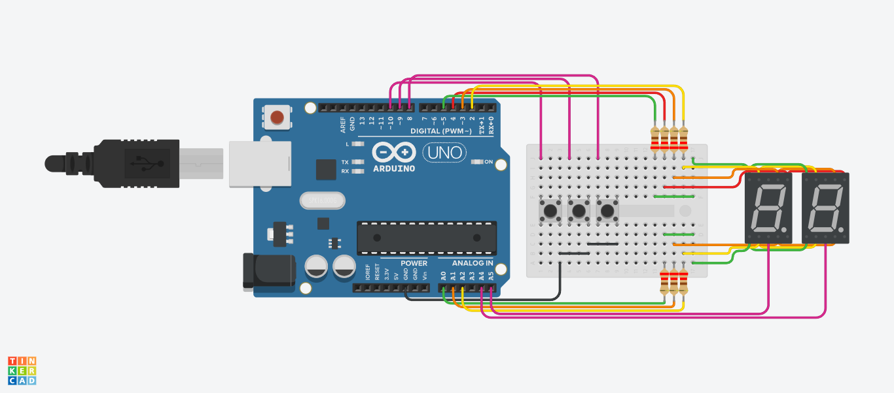
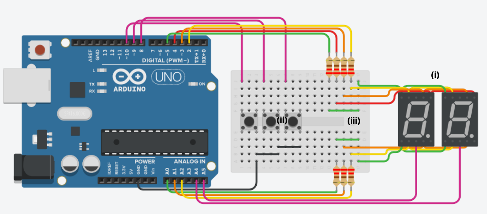
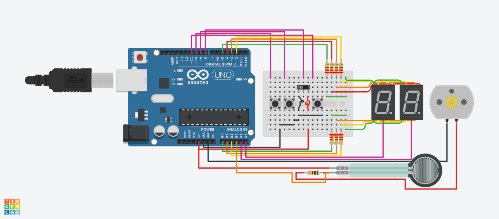
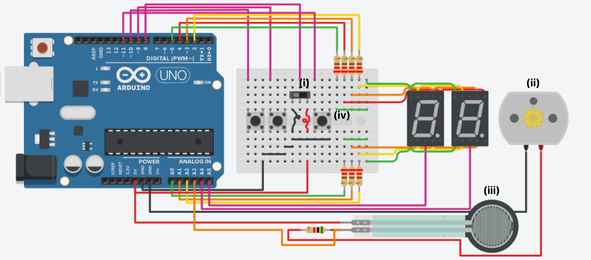

## Parcial de SPD
Este repositorio contiene 2 proyectos (parte 1 y parte 2) que forman parte del parcial de la materia.

### Integrante
- Franco Ezequiel Gomez
- División B

## Proyecto: Contador 0 a 99 (Parte 1)

## 🔗 Links al proyecto
- [Tinkercad](https://www.tinkercad.com/things/aOYiibnDjWu)
- [Código]()

## Descripción
Esta primera parte del proyecto consta de la implementación de 2 displays de 7 segmentos multiplexados (i), 3 pulsadores (ii) y una placa de pruebas (iii).

Los displays se usan para mostrar un contador que inicia en 00 y termina en 99, los pulsadores son utilizados para:
- incrementar el pulsador en 1
- decrementar el pulsador en 1
- volver el contador a 00

Lo interesante de utilizar 2 displays multiplexados es que, además de compartir recursos, podemos representar 2 números; decena y unidad.

Lo difícil aparece al momento de querer mostrar 2 números a la vez, ya que no pueden estar ambos encendidos al mismo tiempo porque mostrarían el mismo número ambos displays. Para solucionar este problema se hace lo siguiente:

1. Se enciende (con 0 en este caso) el display el cual se requiere mostrar un número.
2. Se forma el número en el display con los pines correctos.
3. Se apaga el el led anteriormente prendido (con 1).
4. Luego de un delay imperceptible se enciende el otro display para realizar lo mismo que con el primero.

Este rapido encendido y apagado constante entre ambos displays genera un efecto visual en el cual pareciera que estan prendidos a la vez.

## Función encargada de generar este efecto.

Esta función recibe como parámetro el número que se quiere mostrar entre los displays. 
* Primero apaga ambos displays y utiliza una función llamada "showNumber" que prende los pines que generan el número del parametro.
* Se lo divide por diez para generar solo la decena, se apaga la unidad (con el propósito de solo mostrar la decena) y luego de 10ms es apagado nuevamente para repetir lo mismo al encender la unidad.

~~~ C (lenguaje en el que esta escrito)
void handleDigits(int number)
{
  int unit;
  // apago los displays poniendo ambos en HIGH
  lightOn(L_DISP);
  lightOn(R_DISP);
  // enciendo el número
  showNumber(number / 10);
  // muestro la decena:
  lightOff(R_DISP); // apago la unidad
  lightOn(L_DISP); // enciendo la decena
  // 10 ms de retardo para apagar ambos de nuevo
  delay(10); // pocos ms para estabilidad visual
  // apago los displays de nuevo poniendo ambos en HIGH
  lightOn(L_DISP);
  lightOn(R_DISP);
  // en caso de ser un número con decena
  if (number >= 10 && number <= 99)
  {
  // divido el parametro entre 10 para obtener solo la unidad
    unit = number % 10;
  }
  else { // en caso de no tener decena
    unit = number;
  }
  // muestro la unidad:
  showNumber(unit);
  lightOff(L_DISP); // apago la decena
  lightOn(R_DISP); // enciendo la unidad
  // 10 ms de retardo para apagar ambos de nuevo
  delay(10); // pocos ms para estabilidad visual
}
~~~

## Proyecto: Switch de Contador a Números Primos (Parte 2)

## 🔗 Links al proyecto
- [Tinkercad](https://www.tinkercad.com/things/aOYiibnDjWu)
- [Código]()

## Descripción
Para esta segunda parte se agrega un botón deslizante o switch (i), un motor de corriente continua (ii) y por ultimo, un sensor de fuerza (iii). También se modifica uno de los pulsadores (iv).

El nuevo switch agregado es utilizado para cambiar lo que se muestra en los displays. En la primer posición de este botón deslizante, los displays mostrarán un contador de 1 en 1 con sus respectivos incrementos y decrementos. Al pasarlo a la segunda posición, los displays comenzaran realizar el aumento y el decremento solo mostrando números primos.

El pulsador modificado nos permite mostrar por los displays la fuerza aplicada al sensor de fuerza que mueve el motor. Este pulsador solo es válido en la primera posición del switch.

## Funcionamiento de los Pulsadores

Uno de los desafios más grandes en estas 2 partes del proyecto fue encontrar la manera de contar solo un pulso del pulsador y no si esta constantemente presionado.

Este funcionamiento es el mismo para ambas partes del proyecto, sin embargo, en la parte 2 fue ligeramente modificado.

Básicamente, al inicio de cada loop se registra el valor que tiene el pulsador en ese momento y se los guarda en un arreglo. Luego se inicia un bucle de 3 iteraciones y aparece una condición.

Esta condición compara el estado registrado contra un estado previamente establecida (esto con el propósito de detectar si al inicio del loop se detectó un valor diferente al anterior)

En caso de ser LOW se accede al contador y se lo módifica según el pulsador presionado. Luego del bucle for, se actualiza el valor anterior con el actual para continuar comparando cambios de valores en las proximas iteraciones del loop.

Finalmente se muestran el número del contador en el display.

### Funcionamiento de los pulsadores (código de la parte 1)
~~~ C (lenguaje en el que esta escrito)
  // leyendo constantemente el estado actual de los pulsadores 
  int incCurrentState = digitalRead(INC_BTN);
  int decCurrentState = digitalRead(DEC_BTN);
  int resCurrentState = digitalRead(RES_BTN);
  // arreglo con los estados actuales
  int btnStates[3] = {incCurrentState, decCurrentState, resCurrentState};
  // al evaluar 3 pulsadores (incremento, decremento y reset), el for tiene 3 iteraciones
  for (int i = 0; i < 3; i++)
  {
    // se compara un cambio en el estado actual del pulsador (detecta un 0 en el pulsador) 
    if(btnStates[i] != btnLastStates[i]) // linea 17
    {
      // si es 0 se presionó (pullup interno)
      if (btnStates[i] == LOW)
      {
        // (aumenta en 1, decrementa en 1, o establece en 0 el contador) solo se accede en caso de presionar el pulsador
        handleCounter(i);
      }
    }
  }
  // se los establece como iguales para realizar la comparación de la línea 48
  btnLastStates[0] = incCurrentState;
  btnLastStates[1] = decCurrentState;
  btnLastStates[2] = resCurrentState;
  // se muestra en el display el numero actual del contador
  handleDigits(counter);
~~~